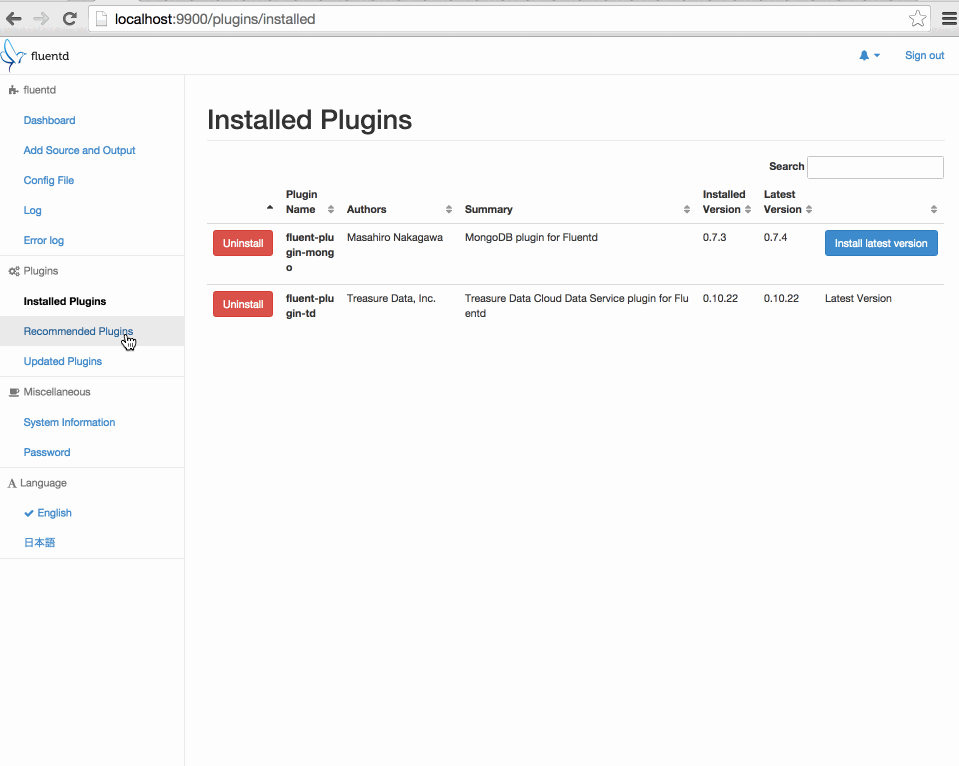
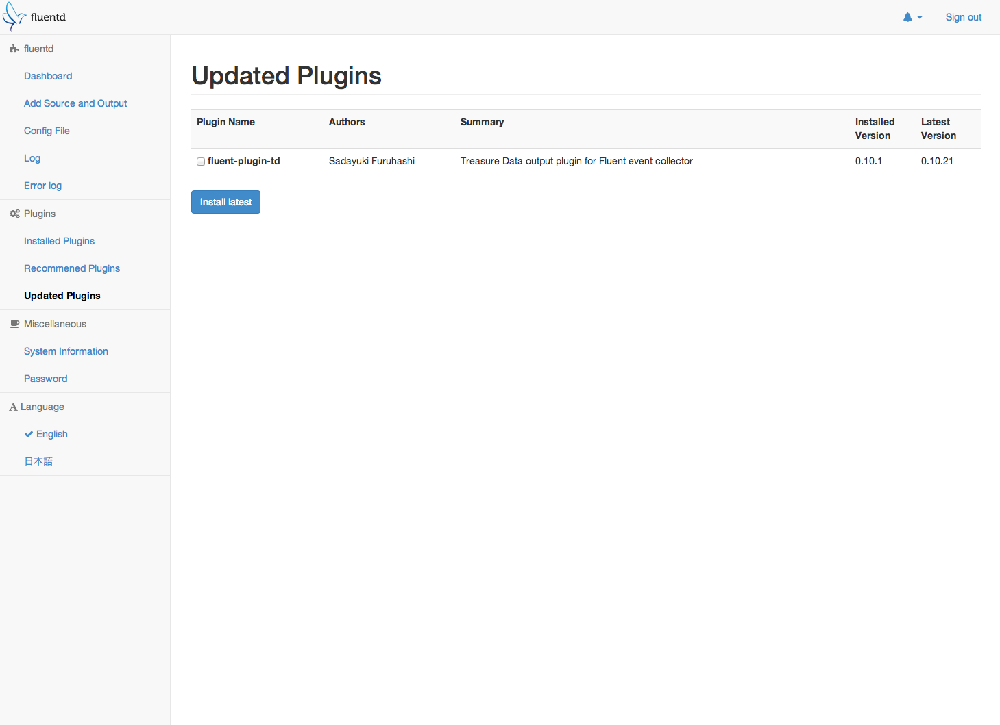

# Fluentd UI

[fluentd-ui](https://github.com/fluent/fluentd-ui) is a browser-based [fluentd](http://fluentd.org/) and [td-agent](http://docs.treasuredata.com/articles/td-agent) manager that supports following operations.

* Install, uninstall, and upgrade Fluentd plugins
* start/stop/restart fluentd process
* Configure Fluentd settings such as config file content, pid file

  path, etc

* View Fluentd log with simple error viewer

## Getting Started

If you've installed td-agent, you can start it by `td-agent-ui start` as below:

```text
$ sudo /usr/sbin/td-agent-ui start
Puma 2.9.2 starting...
* Min threads: 0, max threads: 16
* Environment: production
* Listening on tcp://0.0.0.0:9292
```

Or if you use fluentd gem, install fluentd-ui via `gem` command at first.

```text
$ gem install -V fluentd-ui
$ fluentd-ui start
Puma 2.9.2 starting...
* Min threads: 0, max threads: 16
* Environment: production
* Listening on tcp://0.0.0.0:9292
```

Then, open [http://localhost:9292/](http://localhost:9292/) by your browser.

The default account is username="admin" and password="changeme"


## Screenshots

\(v0.3.9\)

### Dashboard


### Setting


### in\_tail setting


### Plugin



    

If this article is incorrect or outdated, or omits critical information, please [let us know](https://github.com/fluent/fluentd-docs-gitbook/issues?state=open). [Fluentd](http://www.fluentd.org/) is a open source project under [Cloud Native Computing Foundation \(CNCF\)](https://cncf.io/). All components are available under the Apache 2 License.

