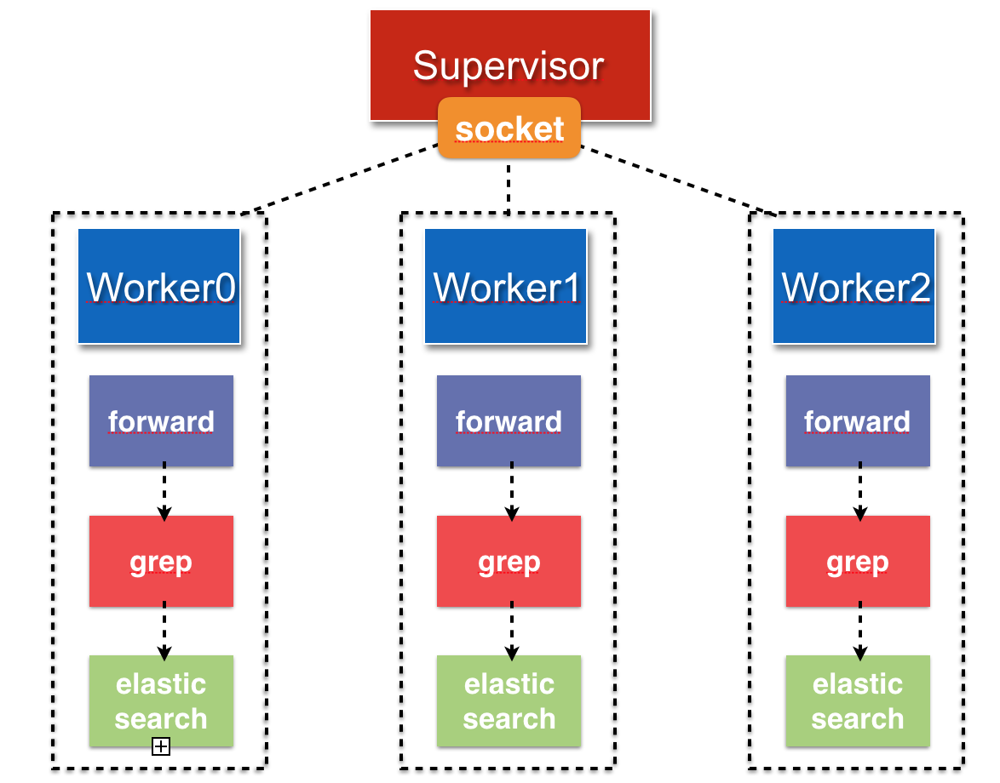

# Multi Process Workers

This article describes how to use Fluentd's multi-process workers feature for high traffic. This feature launches two or more fluentd workers to utilize multiple CPU powers.

This feature can simply replace `fluent-plugin-multiprocess`.

## How It Works

By default, one instance of `fluentd` launches a supervisor and a worker. A worker consists of input/filter/output plugins.

Multi-process workers feature launches multiple workers and use a separate process per worker. `fluentd` provides several features for multi-process workers, so you can get multi-process merits.



## Configuration

### `workers` Parameter

`<system>` directive has `workers` parameter for specifying the number of workers:

```text
<system>
  workers 4
</system>
```

With this configuration, fluentd launches four \(4\) workers.

### `<worker>` directive

Some plugins do not work with multi-process workers feature automatically, e.g. `in_tail`. However, these plugins can be configured to run on specific workers with `<worker N>` directive. `N` is a zero-based worker index.

In the following example, the `in_tail` plugin will run only on worker 0 out of the 4 workers configured in the `<system>` directive:

```text
<system>
  workers 4
</system>

# work on multi process workers. worker0 - worker3 run in_forward
<source>
  @type forward
</source>

# work on only worker 0. worker1 - worker3 don't run in_tail
<worker 0>
  <source>
    @type tail
  </source>
</worker>

# <worker 1>, <worker 2> or <worker 3> is also ok
```

With `<worker>` directive, non-multi-process-ready plugins can seamlessly be run along with multi-process-ready plugins.

### `<worker N-M>` directive

As of Fluentd v1.4.0, `<worker N-M>` syntax has been introduced:

```text
<system>
  workers 6
</system>

# work on worker 0 and worker 1
<worker 0-1>
  <source>
    @type forward
  </source>

  <filter test>
    @type record_transformer
    enable_ruby
    <record>
      worker_id ${ENV['SERVERENGINE_WORKER_ID']}
    </record>
  </filter>

  <match test>
    @type stdout
  </match>
</worker>

# work on worker 2 and worker 3
<worker 2-3>
  <source>
    @type tcp
    <parse>
      @type none
    </parse>
    tag test
  </source>

  <filter test>
    @type record_transformer
    enable_ruby
    <record>
      worker_id ${ENV['SERVERENGINE_WORKER_ID']}
    </record>
  </filter>

  <match test>
    @type stdout
  </match>
</worker>

# work on worker 4 and worker 5
<worker 4-5>
  <source>
    @type udp
    <parse>
      @type none
    </parse>
    tag test
  </source>

  <filter test>
    @type record_transformer
    enable_ruby
    <record>
      worker_id ${ENV['SERVERENGINE_WORKER_ID']}
    </record>
  </filter>

  <match test>
    @type stdout
  </match>
</worker>
```

With this directive, you can specify multiple workers per worker directive.

### `root_dir/@id` parameter

These parameters must be specified when you use the file buffer.

With multi-process workers, you cannot use the fixed `path` configuration for file buffer because it conflicts buffer file path between processes.

```text
<system>
  workers 2
</system>

<match pattern>
  @type forward
  <buffer>
    @type file
    path /var/log/fluentd/forward # This is not allowed
  </buffer>
</match>
```

Instead of a fixed configuration, fluentd provides the dynamic buffer path based on `root_dir` and `@id` parameters. The stored path is `${root_dir}/worker${worker index}/${plugin @id}/buffer` directory.

```text
<system>
  workers 2
  root_dir /var/log/fluentd
</system>

<match pattern>
  @type forward
  @id out_fwd
  <buffer>
    @type file
  </buffer>
</match>
```

With this configuration, `forward` output buffer files are stored into `/var/log/fluentd/worker0/out_fwd/buffer` and `/var/log/fluentd/worker1/out_fwd/buffer` directories.

## Operation

Each worker consumes memory and disk space separately. Take care while configuring buffer spaces and monitoring memory/disk consumption.

## Multi-Process Workers and Plugins

### Input Plugin

There are three \(3\) types of input plugins:

* feature supported and server helper based plugin
* feature supported and plain plugin
* feature unsupported

#### feature supported and server helper based plugin

Server plugin helper based plugin can share port between workers. For example, `forward` input plugin does not need multiple ports on multi process workers. `forward` input's port is shared among workers.

```text
<system>
  workers 4
</system>

<source>
  @type forward
  port 24224 # 4 workers accept events on this port
</source>
```

#### feature supported and plain plugin

Non-server plugin helper based plugin set up socket/server in each worker. For example, `monitor_agent` needs multiple ports on multi-process workers. The port is assigned sequentially.

```text
<system>
  workers 4
</system>

<source>
  @type monitor_agent
  port 25000 # worker0: 25000, worker1: 25001, ...
</source>
```

#### feature unsupported

Some plugins do not work on multi-process workers. For example, `tail` input does not work because `in_tail` cannot be implemented with multi process.

You can run these plugins with `<worker N>` directive. See "Configuration" section.

### Output Plugin

By default, no additional changes are required but some plugins do need to specify the `worker_id` in the configuration. For example, `file` and `S3` plugins store events into a specified path. The problem is if the plugins under multi-process workers flush events at the same time, the destination path is also the same which results in data loss. To avoid this problem, a `worker_id` or some random string can be configured.

```text
# s3 plugin example

<match pattern>
  @type s3

  # Good
  path "logs/#{worker_id}/${tag}/%Y/%m/%d/"

  # Bad on multi process worker!
  path logs/${tag}/%Y/%m/%d/
</match>
```

See [Configuration File](../configuration/config-file.md#embedded-ruby-code) article for embedded Ruby code feature.

## FAQ

### Fluentd cannot start with multi-process workers, why?

You may see following error in the fluentd logs:

```text
2018-10-01 10:00:00 +0900 [error]: config error file="/path/to/fluentd.conf" error_class=Fluent::ConfigError error="Plugin 'tail' does not support multi workers configuration (Fluent::Plugin::TailInput)"
```

This means that the configured plugin does not support multi-process workers. All configured plugins must support multi-process workers. See "Multi-Process Worker and Plugins" section above.

If this article is incorrect or outdated, or omits critical information, please [let us know](https://github.com/fluent/fluentd-docs-gitbook/issues?state=open). [Fluentd](http://www.fluentd.org/) is an open-source project under [Cloud Native Computing Foundation \(CNCF\)](https://cncf.io/). All components are available under the Apache 2 License.

